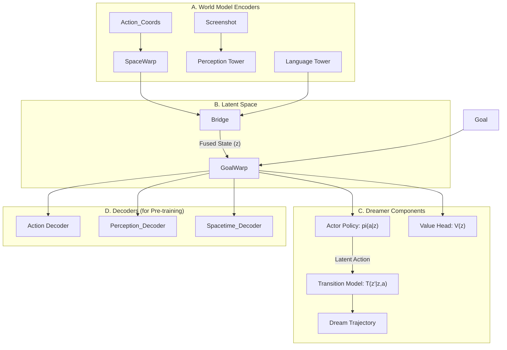

# Grounded Interface Agent with Latent Space Warping (GIA-Warp)

This is an advanced implementation of the Grounded Interface Agent (GIA), enhanced with a "Dreamer"-style reinforcement learning paradigm and a novel set of "Warp" modules. These modules dynamically reshape the agent's internal latent space—spanning time, space, and goals—to achieve more efficient and human-like UI task automation.

The agent is benchmarked on the **OSWorld** dataset, with a complete toolchain for training, evaluation, and analysis.

[](https://github.com/your-org/GroundedInterfaceAgent/actions/workflows/lint.yml)

## Key Features

- **Dreamer-style RL**: Learns a World Model from real data and then trains Actor-Critic policies efficiently in a "dream" latent space.
- **Warp Modules**:
    - **Goal-Space Warp**: A Real-NVP (flow-based) model that warps the latent space based on the task goal, guided by a Jacobian regularization loss.
    - **Time/Uncertainty Warp**: Adapts temporal resolution, processing uncertain states with more detail.
    - **SpaceWarp**: Injects spatial coordinate information directly into the visual stream.
- **Multi-Dataset Training**: A `BalancedConcatDataset` seamlessly mixes synthetic, Mind2Web, and ScreenAgent data with configurable weights.
- **End-to-End Workflow**:
    - **Automated OSWorld Evaluation**: A single script to run the benchmark and summarize the success rate.
    - **Hyper-parameter Sweeping**: `run_sweep.py` to perform grid searches over key parameters like Warp loss weights and `alpha_timewarp`.
    - **Advanced Training Optimizations**: Supports `bfloat16`, gradient checkpointing, and gradient accumulation out-of-the-box.
- **Code Quality**: Enforced by `pre-commit` hooks (black, isort, ruff) and a CI pipeline.

## Architecture

The agent uses a Quaternity architecture (Language, Perception, Action, Spacetime) with a central Grounding Bridge. This is extended by the Dreamer components (Transition Model, Reward Head, Value Head) and our novel Warp modules.



## GIA-Dreamer Architecture

The agent's architecture is built upon three core pillars: a **World Model** that understands the environment, a **Dreamer** that learns behaviors through imagined scenarios, and novel **Warp Modules** that dynamically reshape the model's internal understanding of time, space, and goals.

```mermaid
graph TD
    subgraph "Phase 1: World Model Learning (from Real Data)"
        direction LR
        Obs[Raw Observation<br>(Screenshot, Instruction)] --> WM_Enc[World Model Encoders]
        WM_Enc --> Latent_H[Latent State h_t]
        Latent_H --> WM_Dec[World Model Decoders]
        WM_Dec --> Reconstruction_Loss[Reconstruction &<br>Contrastive Losses]
    end

    subgraph "Phase 2: Actor-Critic Learning (in Dream)"
        direction LR
        Dream_Start[Start from h_t] --> Plan[Plan in Dream<br>using Transition Model]
        Plan --> Trajectory[Imagined Trajectory<br>(States, Actions, Rewards)]
        Trajectory --> AC_Update[Update Actor & Critic<br>via λ-returns]
    end

    Obs -- "1. Collect Experience" --> WM_Enc
    WM_Enc -- "2. Start Dream From" --> Dream_Start
    AC_Update -- "3. Generate Action" --> Action[Execute Action in Env]
    Action -- " " --> Obs

```

### 1. World Model (The Observer)
The World Model is responsible for perceiving the environment and grounding different modalities into a shared representational space.

*   **Towers**:
    *   **Language Tower**: A Large Language Model (e.g., Llama-3-8B) to encode textual instructions.
    *   **Perception Tower**: A Vision Transformer (e.g., UI-TARS Vision) to encode screenshots.
    *   **Action & Spacetime Towers**: MLPs to encode action and warp vectors.
*   **Grounding Bridge**: A cross-attention mechanism that fuses language and vision features into a unified latent state `h_t`.
*   **Decoders**: A suite of decoders that reconstruct one modality from another, enabling a comprehensive, multi-objective loss function.

### 2. Dreamer (The Planner)
Instead of learning directly from expensive real-world interactions, the agent learns behaviors by "dreaming" within its learned World Model.

*   **Transition Model**: Predicts the next latent state `h_{t+1}` given the current state `h_t` and a latent action `a_t`.
*   **Reward & Value Heads**: Predict the expected reward and state-value for any imagined state.
*   **Actor-Critic**:
    *   The **Actor** learns a policy to select actions that maximize future rewards within the dream.
    *   The **Critic** (Value Head) learns to accurately predict the long-term value of being in a certain state.
    This process, based on λ-returns, allows for efficient and far-sighted policy learning.

### 3. Warp Modules (The Reality Shaper)
This is the core novelty of the architecture. Warp modules are dynamic, learnable transformations that alter the model's internal "coordinate system" to improve learning and task execution.

*   **GoalWarp (Real-NVP)**: A normalizing flow that reshapes the latent space based on a `goal` vector (e.g., target coordinates and UI element type). This makes it easier for the model to attend to relevant information for a given goal. Its Jacobian determinant is used as a regularization loss.
*   **Time/Uncertainty Warp**: A module that stretches or compresses the model's internal sense of time. It learns to "slow down" and allocate more computational resources when uncertainty (proxied by TD-error) is high.
*   **SpaceWarp**: Injects coordinate information directly into the vision features, helping to ground visual elements spatially.

This architecture allows the agent to not only perceive and act, but also to dynamically adapt its internal world representation for more efficient and intelligent problem-solving.

## Setup

### 1. Environment
We recommend a Python 3.10+ environment.
    ```bash
python -m venv venv
source venv/bin/activate
    pip install -r requirements.txt

# Optional: For development, install pre-commit hooks
pip install pre-commit
pre-commit install
```
### 2. Datasets
Create a `raw` directory for original datasets and a `data` directory for the converted formats.

- **Mind2Web**:
  ```bash
  cd /path/to/your/project/raw
  git lfs install
  git clone https://huggingface.co/datasets/mind2web/mind2web
  ```
- **ScreenAgent**:
  ```bash
  cd /path/to/your/project/raw
  wget https://huggingface.co/datasets/ScreenAgent/ScreenAgent/resolve/main/screenagent.zip
  unzip screenagent.zip -d screenagent
  ```

## The GIA-Warp Workflow

### Step 1: Data Preparation
Convert the downloaded datasets into the GIA `metadata.json` format. The scripts automatically create the 16-dimensional goal vectors.

```bash
# Synthetic Data (no download needed)
python scripts/generate_synthetic_gui.py --num_samples 100000 && mv synthetic_dataset data/synthetic

# Mind2Web
python scripts/convert_mind2web.py raw/mind2web data/m2w

# ScreenAgent
python scripts/convert_screenagent.py raw/screenagent data/screen
```

### Step 2: Training
Training is configured via YAML files in `configs/`. A baseline training configuration is provided. You can launch a training run and override any parameter from the command line.

**Example Training Command:**
This command starts the Dreamer training using `bfloat16` for speed and gradient checkpointing for memory efficiency.
```bash
# Ensure your config file points to the correct data roots
# e.g., in configs/training/baseline_osw.yaml
# dataset_roots:
#   - /path/to/your/project/data/synthetic
#   - /path/to/your/project/data/m2w
#   - /path/to/your/project/data/screen

python main.py mode=train \
  --config-path configs/training --config-name baseline_osw \
  use_bfloat16=true \
  use_grad_checkpoint=true \
  training.grad_accumulation_steps=4 \
  log_dir=runs/my_first_run \
  checkpoint_root=checkpoints/my_first_run
```

### Step 3: Hyper-parameter Sweep (Optional)
Use `run_sweep.py` to launch a grid search. It will create a directory in `outputs/sweeps/` for each job.
```bash
python scripts/run_sweep.py --jobs 4 --epochs 5
```
After the sweep, summarize the results:
```bash
# Replace <timestamp> with the actual folder name
python scripts/summarize_sweep.py outputs/sweeps/<timestamp>
```
This will print a summary and create a symlink named `best_ckpt` pointing to the checkpoint with the highest success rate.

### Step 4: Evaluation
Evaluate your trained model on the OSWorld benchmark.
```bash
# Use a specific checkpoint
CKPT_PATH="checkpoints/my_first_run/latest/best.safetensors"

# Or the best one from a sweep
CKPT_PATH="outputs/sweeps/<timestamp>/best_ckpt"

python scripts/eval_osworld.py \
  --ckpt "$CKPT_PATH" \
  --domain all \
  --max_steps 15 \
  --result_dir outputs/eval_results
```
Results, including the overall success rate, will be saved in `outputs/eval_results/summary.json`.

### Step 5: Inference and Visualization
- **CLI Inference**: Run a prediction on a single image.
  ```bash
  python scripts/cli_infer.py \
    --ckpt "$CKPT_PATH" \
    --image "/path/to/screenshot.png" \
    --instruction "Click the search button"
  ```

- **Warp Visualization**: Generate a t-SNE plot to see how the GoalWarp module transforms the latent space.
  ```bash
  python scripts/visualize_warp.py \
    --checkpoint "$CKPT_PATH" \
    --samples 500 \
    --out warp_visualization.png
  ```

## Vector Specifications

The `goal` and `warp` vectors are 16-dimensional. The `goal` vector is critical for conditioning the GoalWarp module.

| Index Range | Content                               | Notes                                   |
|-------------|---------------------------------------|-----------------------------------------|
| `0-1`       | Normalized Click Coords `(x, y)`      | `[0, 1]` range.                         |
| `2-11`      | UI Element Tag (10-class one-hot)     | See vocab below.                        |
| `12-15`     | Reserved                              | Padded with zeros. For future use.      |

**UI Tag Vocabulary (Index 2-11):**
`button`, `a` (link), `input`, `img`, `select`, `textarea`, `checkbox`, `radio`, `div`, `span`

## Contributing
This project uses `pre-commit` to enforce code style. Please install and use the hooks for any contributions.
    ```bash
pre-commit install
    ``` 
Pull requests are automatically checked for linting via GitHub Actions. 
